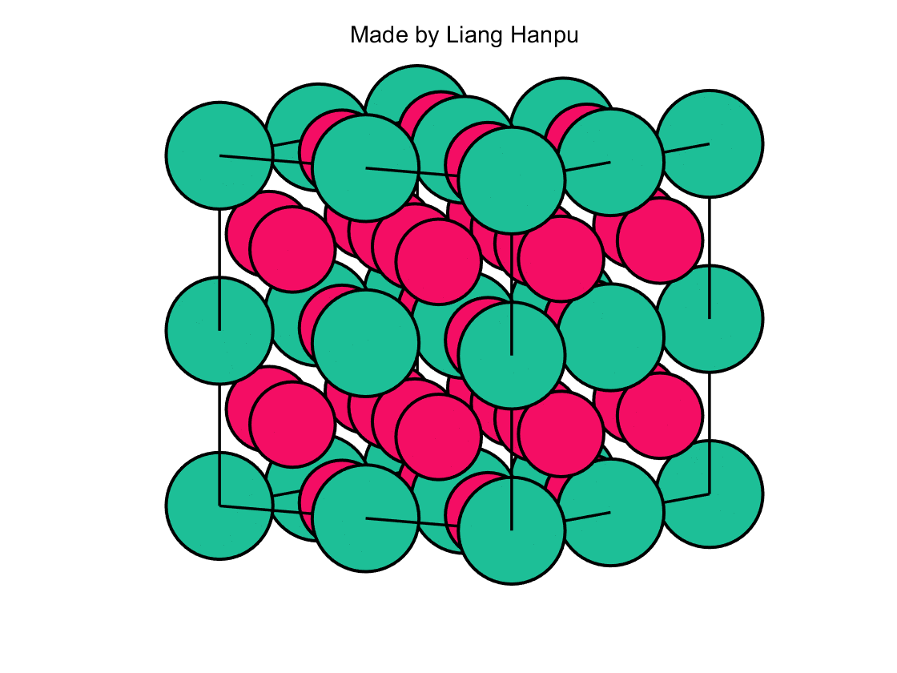
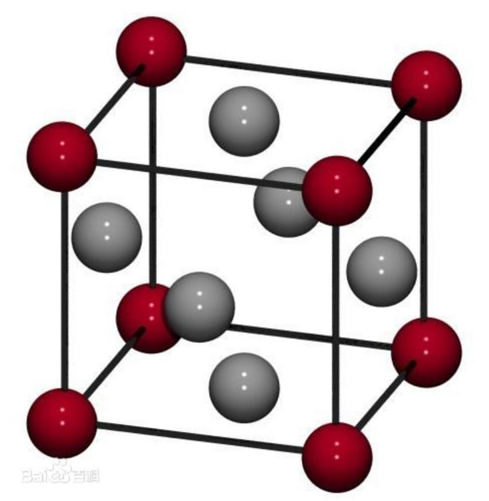
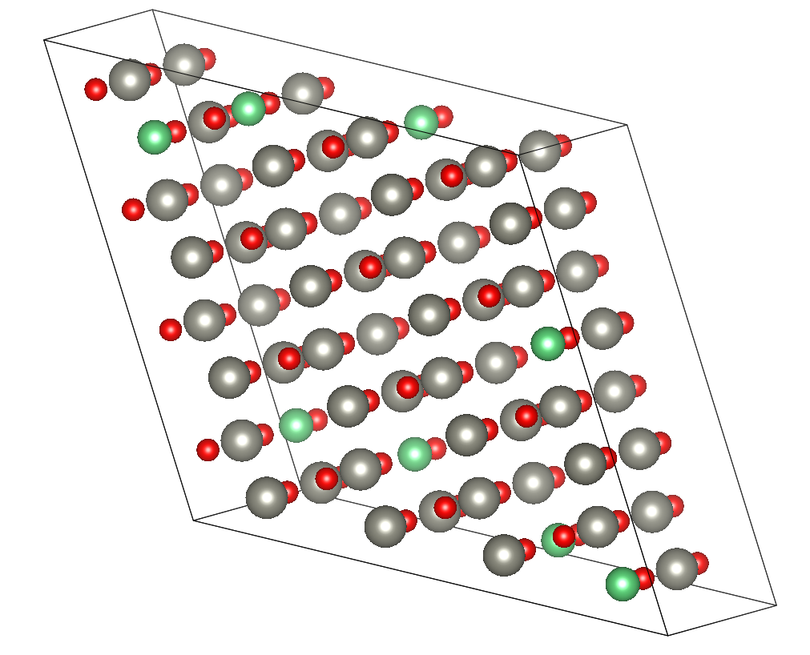
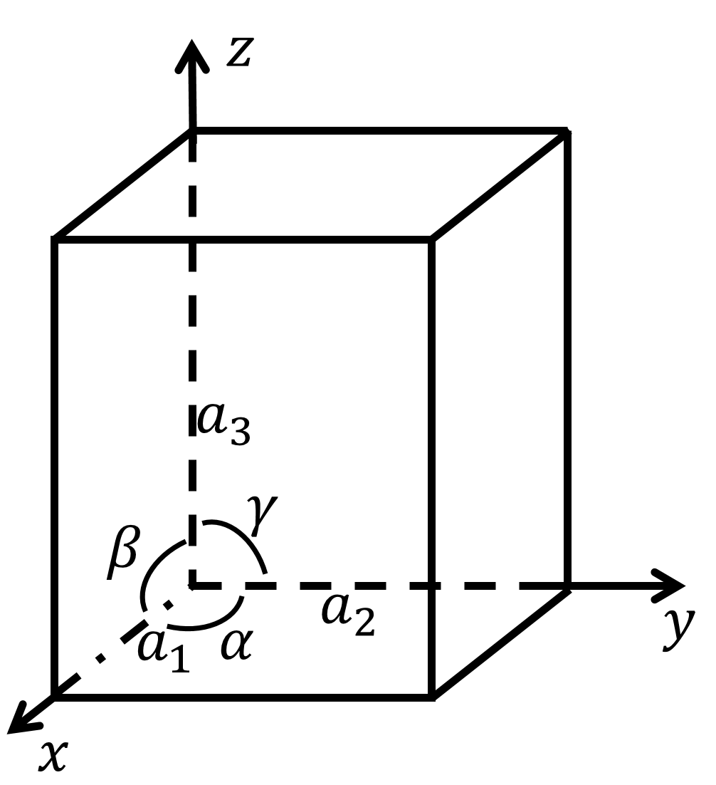
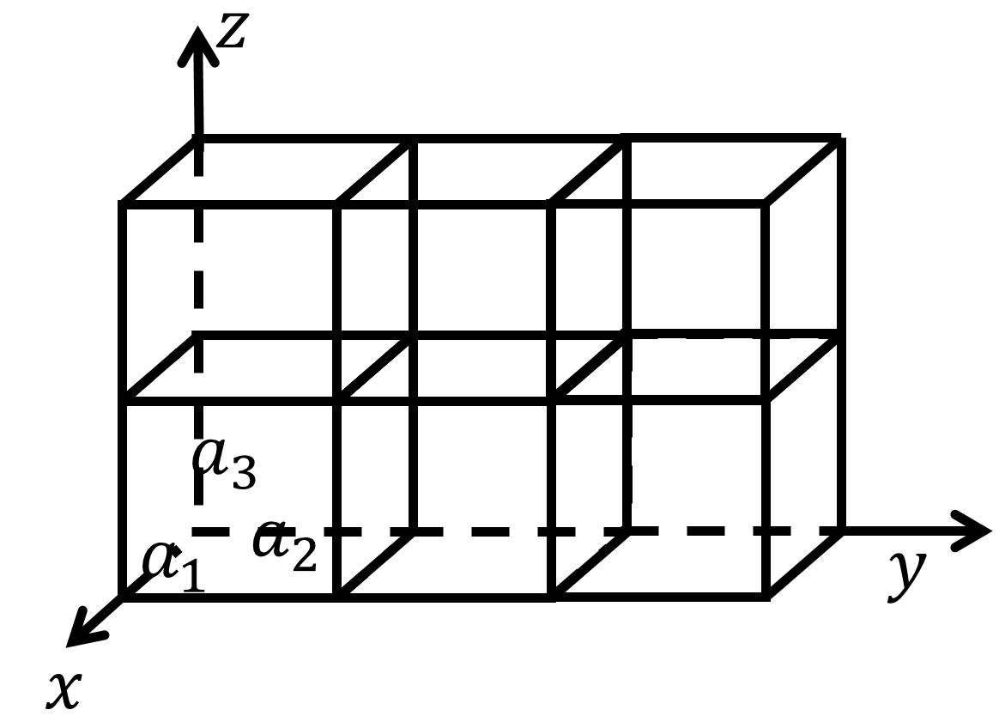

# MATLAB做晶体结构图(固体物理).md

## 写在前面

最近在复习考研复试《固体物理》这一门课，去年学的内容已经忘干净了，所以就翻开前几页。突然看到了面心立方和体心立方结构图，想到了去年室友用Mathematica做了晶胞的结构图，于是就手痒痒自己也想来做一个。

具体物理内容不会涉及到多少，但还是要求大家能对“简单立方结构”、“体心立方结构”、“面心立方结构”有一个简单的理解，因为我比较懒，所以我就不放这些基础内容凑字数了。

用MATLAB跑出来的效果图为



## 基本的思考

如果我们想要做一个类似于这样子的结构图的话，我们需要知道些什么?



如果我们想要做成这么大个超胞的话，又需要在上面的基础上怎么做?



有过做计算的同学已经想到了，需要计算物理中，描述晶胞中原子位置的文件POSCAR，然后把POSCAR拖到VESTA中就可以上面这幅图了。

所以我们这里模拟POSCAR来输入参数：

- **晶胞参数**：描述晶胞大小的参数。
- **超胞大小**：当晶胞数量大于1个并且周期性变化时，用三个数字描述其在三个方向上的晶胞叠加数目。
- **各个原子的坐标**：没有这个还怎么画出来原子啊。

## 基本参数

### 晶胞参数

晶胞参数包括6个值：三条边$a1, a2, a3$和三个角$\alpha, \beta, \gamma$，如下图所示



因为编写程序的复杂程度问题，我们这里只考虑$\alpha\neq 90^o, \beta=\gamma=90^o$这样的情况。如果不这样的话，那就有点难了，需要考虑这个晶胞斜向的角度。

### 超胞大小

超胞大小是用来形容我们这个超胞到底由几个晶胞组成，以及他们的排列方式是怎么样子的。就比如下图中，沿着a1方向的层数为1个，沿着a2方向的层数为3，沿着a3方向的层数为2.所以我们就可以设定为$[1, 3, 2]$。

**值得注意的是，这里我用的并不是$x, y, z$轴的方向！！！**因为如果$\alpha\neq 90^o$的话，那么a2方向就不和y轴平齐了，所以为了保证两个晶胞相连，就必须要沿着晶轴方向拓展。



### 原子位置

这个没什么好说的，如果我们建立好了超胞，那么直接在对应的坐标画上原子就好。

## 开始写程序

### 设定参数

首先我们来设定好上面的参数

```matlab
%% 参数设定
global cell_size a1 a2 a3 alpha beta gamma
% 晶胞参数
a = [1, 1, 1];
% 三个角度
angle = [pi/2, pi/2, pi/2];
% 超胞大小
cell_size = [2, 2, 2];
% 简单立方
position1 = [0, 0, 0; ...
           1, 1, 0; ...
           1, 0, 0; ...
           0, 1, 0; ...
           0, 0, 1; ...
           1, 1, 1; ...
           1, 0, 1; ...
           0, 1, 1];
% 体心
position2 = [0.5, 0.5, 0.5];
% 面心
position3 = [0, 0.5, 0.5; ...
             0.5, 0, 0.5; ...
             0.5, 0.5, 0; ...
             1, 0.5, 0.5; ...
             0.5, 1, 0.5; ...
             0.5, 0.5, 1];

[a1, a2, a3] = deal(a(1), a(2), a(3));
[alpha, beta, gamma] = deal(angle(1), angle(2), angle(3));
```

这里将体心和面心的原子分别提取出来，作图的时候再放上去和简单立方的一起做就好了。

### 作图

我们为了图像美观就得做一些处理坐标轴的事情

```matlab
%% 作图
figure
% 作图设置
hold on, axis equal
axis image off
view(-37.5, 30)
```

然后我们就可以愉快的画超胞的框架和各个原子啦，下面的两个函数是我自定义的两个函数

```matlab
% 做超胞框架
plotBox();
% 做各个原子
plotAtoms(position2, [244, 13, 100]/255, 40);
plotAtoms(position1, [29, 191, 151]/255, 50);   %简单立方的一定要放在最后面
```

简单立方因为最大，所以我在里面设定了一些自动变坐标轴大小的内容，所以要放在最后面。

这样子主程序就完成了。后面详细解释这两个函数的内容。

### 做超胞的框架plotBox

我们需要定出立方体的8个顶点，然后做出12条边，这一部分很简单，根据简单的数学就可以推导出公式，然后写出程序来。

```matlab
function plotBox()
% 做边框
    global a1 a2 a3 alpha beta gamma cell_size 
    % 超胞的边长
    [A1, A2, A3] = deal(a1*cell_size(1), a2*cell_size(2), a3*cell_size(3));
    % 8个顶点
    vertex = [0, 0, 0;...
              A1, 0, 0;...
              A2*cos(alpha), A2*sin(alpha), 0;...
              A2*cos(alpha)+A1, A2*sin(alpha), 0;...
              0, 0, A3;...
              A1, 0, A3;...
              A2*cos(alpha), A2*sin(alpha), A3;...
              A2*cos(alpha)+A1, A2*sin(alpha), A3];
    % 12个边
    plotLine(vertex(1,:), vertex(2,:))
    plotLine(vertex(1,:), vertex(3,:))
    plotLine(vertex(2,:), vertex(4,:))
    plotLine(vertex(3,:), vertex(4,:))
    plotLine(vertex(5,:), vertex(6,:))
    plotLine(vertex(5,:), vertex(7,:))
    plotLine(vertex(6,:), vertex(8,:))
    plotLine(vertex(7,:), vertex(8,:))
    plotLine(vertex(1,:), vertex(5,:))
    plotLine(vertex(2,:), vertex(6,:))
    plotLine(vertex(3,:), vertex(7,:))
    plotLine(vertex(4,:), vertex(8,:))
end

function plotLine(x1, x2)
% 做两个点之间的框架线
    plot3([x1(1) x2(1)], [x1(2), x2(2)], [x1(3), x2(3)], 'k', 'linewidth', 1.3)
end
```

### 做各个原子的图

这个才是重头戏。

我们首先要确定出在超胞内，一共有多少个原子。我们之前设置的超胞大小就派上用场了，我们通过三个循环嵌套在一起，遍历出超胞内的所有晶胞，然后将其原子位置加到矩阵中，最后统一作图。

```matlab
function plotAtoms(position, markercolor, markersize)
% 做各原子图像
    global cell_size a1 a2 a3 alpha beta gamma
    % 原始晶胞
    % plot3(position(:,1), position(:,2), position(:,3), 'ok', 'linewidth', 1.5, 'markersize', 50, 'markerfacecolor', [29,191,151]/255)
    % 超胞
    % 遍历得到超胞所有原子
    cur_point = position;
    for i1 = 1:cell_size(1)
        for i2=1:cell_size(2)
            for i3=1:cell_size(3)
                x_plus = a1*(i1-1) + a2*cos(alpha)*(i1-1);
                y_plus = a2*sin(alpha)*(i2-1);
                z_plus = a3*(i3-1);
                cur_point = [cur_point; [position(:,1)+x_plus position(:,2)+y_plus position(:,3)+z_plus]];
            end
        end
    end
    plot3(cur_point(:,1), cur_point(:,2), cur_point(:,3), 'ok', 'linewidth', 1.5, 'markersize', markersize, 'markerfacecolor', markercolor)
    % 设置坐标轴大小
    [x_min, x_max, y_min, y_max, z_min, z_max] = deal(min(cur_point(:,1)), max(cur_point(:,1)), ...
                                                      min(cur_point(:,2)), max(cur_point(:,2)), ...
                                                      min(cur_point(:,3)), max(cur_point(:,3)));
    x_len = (x_max - x_min)/6;
    y_len = (y_max - y_min)/6;
    z_len = (z_max - z_min)/6;
    axis([x_min-x_len x_max+x_len y_min-y_len y_max+y_len z_min-z_len z_max+z_len])
end
```

然后这样就完事了。是不是很简单的。

## 写在后面

以上所有代码我都放在了我的Github中，可以通过点击[我的Github: ]()